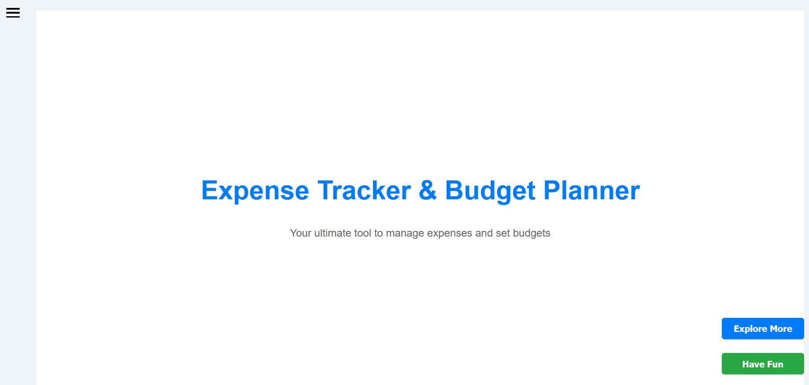
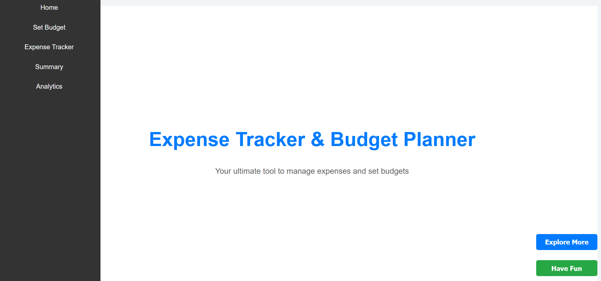
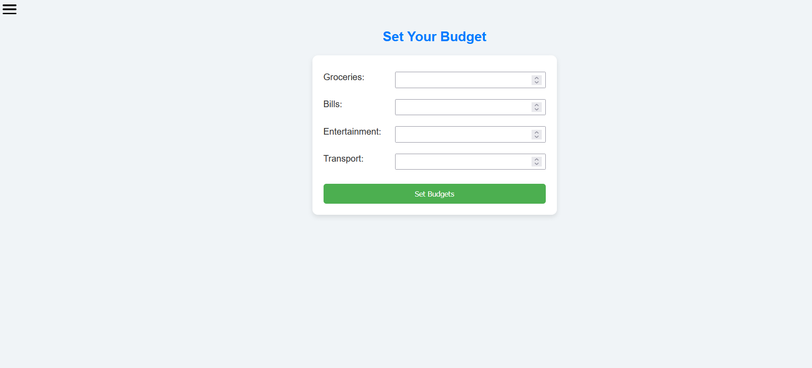
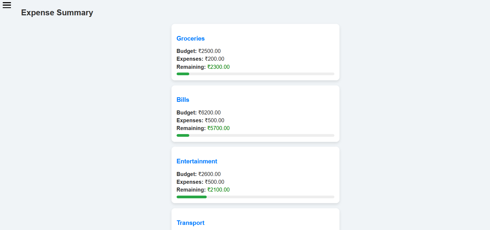
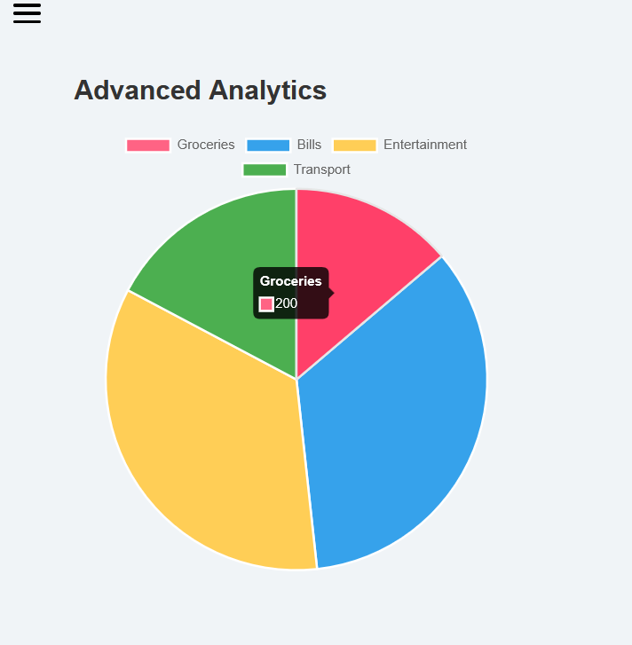

# Expense Tracker & Budget Planner 💰📊

A web-based application built with HTML, CSS, and JavaScript to help users track expenses, set budgets by category, view summaries, and analyze spending habits.

## Features
- Add and categorize expenses
- Set budgets for groceries, bills, entertainment, transport
- Visual analytics with charts
- Responsive and user-friendly design

## Tech Stack
- HTML, CSS, JavaScript
- Chart.js for data visualization

## How to Run
Clone the repository or download ZIP and open `index.html` in any modern web browser.
